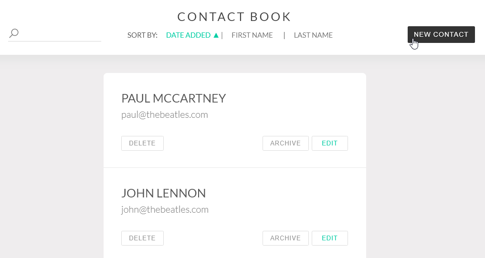

# Contact Book

A contact book web-app built using [Vue.js](https://vuejs.org/) single file components. Bootstrapped with the [Vue CLI](https://cli.vuejs.org/).



## Live Demo

**[https://martin-gv.com/contactbook](https://martin-gv.com/contactbook)**

## Installation

#### To run locally:

```
npm install
npm run serve
```
Then view in a web browser http://localhost:8080/contactbook

#### Build for deployment:

```
npm run build
```
Then upload files in the `/dist` folder to your server.

## Features

- Instant search results
- Multiple sorting options
- Separate archived contact list
- Smooth animations

## Notes

Results are filtered by the search term before being sorted by the selected option. This prevents uneeded sorting of the whole list when a user uses the search feature.

Search feature matches any part of a contact's info. For example, searching "ri" matches both "Ringo" and "Harrison".

Animations are implemented using Vue `<transition>` and `<transition-group>` wrapper components.